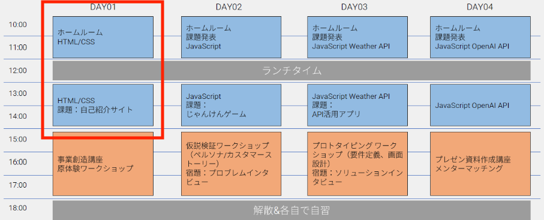
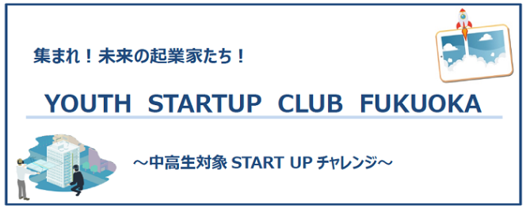

# はじめに

Day01 では HTML/CSS を使って画面を作っていきます。



## 目次

1. 検証ツールを使ってみよう
1. HTML とは
1. CSS とは
1. 自己紹介サイトを作成しよう

### 検証ツールを使ってみよう

- Google Chrome を立ち上げる

- 好きなホームページを 1 つ検索して開く

- 右クリック(Control + クリックでも ok。↓ これが表示されます)


- メニューから検証を選択とこれが表示されます


- 三角をクリックすると一つ深い部分が見えます


👀 `<div>***</div>`や`<a>***</a>`や`<h1>***</h1>`、その中には`class`や`id`や`style`など、他にもいろんな英単語が表示されていますね。

✅ この<>で表示されている部分が Web ページの骨組みで**HTML**と言います(ちなみに style の部分はこのあとでてくる**CSS**を設定している箇所です)

**Day01 で作るもの**


参照: [福岡市ホームページ](https://www.city.fukuoka.lg.jp/keizai/r-support/charm/2024_11_25.html)

- この部分 ☝️ を HTML と CSS を使って作っていきましょう

### フォルダの作成

VSCode から作成するやり方を紹介します。

1. ここをクリック


2. 新規フォルダを選択(今回は Desktop 画面に配置します)


3. フォルダに名前をつける → フォルダ完成 :checkered_flag:


4. それを開く


### HTML とは

- タイトル，文章，画像を画面に表示するための骨組み

#### HTML の準備

ファイルを作成しましょう。

1. このアイコンをクリック


2. `index.html`という名前にする


- web ページのフォーマットを入力します

1. index.html を開く
1. 「!」を入力（必ず半角） → 「tab」を押すと構造ができる ↓

```html
<!DOCTYPE html>
<html lang="en">
  <head>
    <!-- 文書自体の情報（文書名・読み込むファイルなど） -->
    <meta charset="UTF-8" />
    <meta name="viewport" content="width=device-width, initial-scale=1.0" />
    <meta http-equiv="X-UA-Compatible" content="ie=edge" />
    <title>Document</title>
  </head>
  <body>
    <!-- 実際の文章の内容（文章や画像など）．ここにコンテンツを記述する． -->
  </body>
</html>
```

#### HTML の動作確認

- <body> タグ内にh1を書いて動作を確認しましょう

```html
<!DOCTYPE html>
<!-- 🔽 en → jaに変更する -->
<html lang="ja">
  <head>
    <meta charset="UTF-8" />
    <meta http-equiv="X-UA-Compatible" content="IE=edge" />
    <meta name="viewport" content="width=device-width, initial-scale=1.0" />
    <title>YOUTH STARTUP CLUB FUKUOKA Day01</title>
  </head>
  <body>
    <!-- 🔽 下記 1 行を追加 🔽 -->
    <h1>Hello World!</h1>
  </body>
</html>
```

##### ブラウザに index.html を表示する

1. VSCode の index.html を右クリックして Copy Path を選択


1. Chrome のここに貼り付け


1. 画面に「Hello World!」(h1 に入力した文字)が表示されれば ok✅


#### 💡 開発の流れ

1. エディタでコードを書く
2. 保存する（command + s, ctrl + s）
3. ブラウザにて意図した動きや見た目になっているかどうかを確認する
4. コードを編集して保存すると自動的にブラウザ画面にも反映される

##### タグ

- HTML は「タグ」で構成される。タグを書くことでブラウザに対して「どのように表示するか」を指示する

```html
<!-- htmlは「タグ」で挟む！ <br>は改行するためのタグです。-->
<h1>中高生向け起業家育成プログラム<br />「YOUTH STARTUP CLUB FUKUOKA」を開催します</h1>
```

- プログラムがコンテンツの構造を理解できる
- HTML を読むのは「ブラウザ（≒ コンピュータ）
- 定められた形式で記述しないと，正しく表示されない

##### 今回出てくるタグ

- 下記の他にもたくさんのタグがある。全部覚えるのは不可能だが，よく使うものは書いているうちに勝手に覚える。よく使わないものは都度調べれば ok

```html
<!-- 「タグ」で挟む！ -->
<div>この中に文章や画像を入れる「箱」のようなもの</div>

<h1>見出し1（タイトル，文書中に1つしか存在してはならない）</h1>

<p>段落（通常の文章はこれ）</p>

<h2>見出し2</h2>

<!-- 挟まないものもある（単一のタグで成立） -->


<!-- ulの中にliを書いてリスト表示 -->
<ul>
  <li>1つ目</li>
  <li>2つ目</li>
</ul>
```

#### 💡 構造をつくるコツ

- 全体をブロック（div 要素）ごとに分ける！ 箱のイメージ！
- 入れ子構造（ツリー構造）を意識！

```
body
├── div
│   ├── h1
│   └── p
│   └── p
│   └── p
├── /div
├── div
│   ├── h2
│   ├── p
│   └── p
├── /div
```

- 構造を意識してトップ画面を作成しよう
  - `<div></div>`の中に一つのまとまりを作る
  - 画像は[こちら](./youth-top.png)をダウンロードしてください

```html
<div>
  <h1>中高生向け起業家育成プログラム<br />「YOUTH STARTUP CLUB FUKUOKA」を開催します</h1>
  
  <p>
    福岡市内の中高生を対象に、学校・学年の垣根を超えて起業とプログラミングを学ぶプログラム<br />「YOUTH　STARTUP　CLUB　FUKUOKA」を開催します。<br />新しいことにチャレンジしたいみなさんのご応募をお待ちしております！
  </p>
</div>
```

✅ こんな感じになっていれば OK


#### 練習 ✍️

この部分を作ってみよう(HTML のみ)


✅ もちろん背景色とかはまだつけず、こんな感じになっていれば OK


- まとまりを意識しましょう(構造をつくるコツ参照！)

- タイトルは`h2`タグで(`<h1>`がページで一つ)

### CSS とは

- HTML で作った骨組みに背景，文字の大きさ，色を付け足します

#### CSS ファイルの準備

- index.html と同じやり方で`main.css`ファイルを作成

#### CSS を HTML に適用する

- CSS は「CSS ファイル」に記述してきます
- HTML ファイルから CSS ファイルを読み込む必要があります

1. index.html を開く
2. title タグの 1 行下で「link」を入力して tab キー
3. タグができるので，「href=」の後を「main.css」に変更する

```html
<!DOCTYPE html>
<html lang="en">
  <head>
    <meta charset="UTF-8" />
    <meta http-equiv="X-UA-Compatible" content="IE=edge" />
    <meta name="viewport" content="width=device-width, initial-scale=1.0" />
    <title>Document</title>
    <!-- 🔽 下記 1 行を追加 🔽 -->
    <link rel="stylesheet" href="main.css" />
  </head>

  <body></body>
</html>
```

#### CSS の基本的な記述方法

- CSS の命令の適用箇所は HTML 要素（タグやクラス名）を指定します。HTML 要素にクラス名をつけることで，細かく適用箇所を制御することができます
- 場所を指定する方法は下記以外にも多くあるが，当面は「タグに対する指定」「クラスに対する指定」を押されれば問題ありません

##### class の付け方

- 始まりタグの中に `class="class-name"`
  - `"class-name"`はわかりやすい名前にしましょう

```html
<div class="div-common">
  <h1>
    中高生向け起業家育成プログラム
    <br />
    「YOUTH STARTUP CLUB FUKUOKA」を開催します
  </h1>
</div>
```

- CSS ファイルには以下のように HTML タグやクラスごとに指定をしていきます
  - クラス名を指定するときはドットを忘れない！

```css
body {
  /* タグに対して指定 */
  /* ここに文字の色やサイズなどを指定する命令を書く */
}

.div-common {
  /* `.` でクラス名で指定 */
}

.one-class,
.another-class {
  /* 複数のクラスに適用 */
}
```

#### ページのサイズ指定

- サイズは幅と高さを指定します

- 今回は`<body>`タグに対して指定し，ページ全体の幅を 960px に設定します

```css
body {
  /* body の幅を 960 px に設定する */
  width: 960px;
}
```

#### 背景の色，写真の設定

- 最初のセクションに色や画像を設定しましょう

```css
/* 背景を茶色、文字の色を白にする */
h1 {
  background: brown;
  color: white;
}
```

- 完璧に同じ色にしたいときは検証ツールで色を確認できる


```css
h1 {
  background: #a26b01;
  color: white;
  text-align: center; /* テキストを中央揃えにする */
}
```

#### 画像幅を調整する

- クラスを指定します

```html

```

```css
.top-image {
  width: 70%; /* 親要素の幅に合わせる 960pxに対して70%という意味 */
}
```

#### タイトルの周りにスペースをつける

- 窮屈な見栄えなので padding を使ってタイトル周りにスペースを入れます

- `padding: 20px`: 四方に 20px スペースを入れる
- `padding: 20px 0px`: 縦に 20px スペースを入れ、横には 0px つまりスペースを入れない
- `padding: 20px 10px 5px 3px`: 上から時計回りにスペースを指定できる
- `padding-top: 1px`のように単体でスペースをつけることもできる(そのほかは`padding-right`, `padding-bottom`, `padding-left`で指定できる)

```css
h1 {
  background: #a26b01;
  color: white;
  text-align: center;
  padding: 20px 0px; /* 追記 */
}
```

#### 練習 ✍️

2 つ目のセクションタイトルに背景色・padding をつけてみよう！

- ⚠️ h2 のタイトルは左寄せで！


### レイアウト

- 最後にレイアウトを整えていきましょう

  - `Flexbox`を使って横並び・間隔などを調整できます

- `index.html`div タグに`div-common`クラスを追記しましょう(3 箇所)

```html
<div class="div-common"></div>
```

- 2 つのセクションに css で`diplay: flex`を適用します

```css
.div-common {
  display: flex; /* これ */
}
```

💡 `display: flex;`に関連する CSS は「レイアウトを制御したい要素の外側の要素(親要素)」に記述するのがポイント

この時点でブラウザの表示を確認すると・・・


- `Flexbox`は子要素(↔︎ 親要素)を横並びにするのがデフォルトなので縦に並べるように CSS に`flex-direction`を追記します
- 要素を中央揃えにするため`align-items`を追記します

```css
.div-common {
  display: flex;
  flex-direction: column; /* 縦方向に配置 */
  align-items: center; /* 子要素を水平中央揃え */
}
```


- 細かいところを修正していきます
  - h2 のタイトルも h1 と同じ幅・左寄せにする
  - 説明部分(p タグ)を左寄せにする

#### h1, h2 の幅を body いっぱいに広げる

```css
h1 {
  background: #a26b01;
  color: white;
  text-align: center;
  padding: 20px 0px;
  width: 100%; /* 追加 */
}

h2 {
  background-color: #dfcba6;
  text-align: left;
  padding: 20px 0px;
  width: 100%; /* 追加 */
}
```

#### 説明欄を左寄せにする

- description クラスを作って左にスペースを空けつつ、左寄せにしましょう
- また、リストの項目間にスペースを空けます

```css
.description {
  align-self: flex-start; /* リストのみ左寄せ */
  padding-left: 20px; /* リストアイテムの左余白 */
}
```

- この description クラスを p タグにも追加しましょう

```html
<p class="description">
  <!-- クラス追加 -->
  福岡市内の中高生を対象に、学校・学年の垣根を超えて起業とプログラミングを学ぶプログラム
  <br />
  「YOUTH STARTUP CLUB FUKUOKA」を開催します。
  <br />
  新しいことにチャレンジしたいみなさんのご応募をお待ちしております！
</p>

<!-- 省略 -->

<p class="description">
  <!-- クラス追加 -->
  8週間集中で、プログラミングと起業家精神育成ワークショップの2つの思考を同時に学びます。自分のアイデアをウェブアプリケーションという形にする体験を通じて、未来の起業家の卵を育成する講座です。
</p>
```

#### 全体を中央に寄せる

```css
html {
  display: flex; /* フレックスボックスを使用 */
  flex-direction: column; /* 縦方向に配置 */
  align-items: center; /* 垂直方向の中央揃え */
}
```

#### 微調整

- 背景色を追記しましょう

```css
html {
  display: flex;
  flex-direction: column;
  align-items: center;
  background-color: #f0f0ee; /* 追加 */
}

.div-common {
  display: flex;
  flex-direction: column;
  align-items: center;
  width: 100%;
  background-color: white; /* 追加 */
}
```

- 余分なスペースを削除

```css
body {
  width: 960px;
  margin: 0; /* body自体の余白を削除 */
  padding: 0; /* bodyのパディングを削除 */
}

h1 {
  background: #a26b01;
  color: white;
  text-align: center;
  padding: 20px 0px;
  width: 100%;
  margin-top: 0; /* 上のデフォルトマージンをリセット */
}
```

👑 完成 👑


### 課題 ✏️

- 紹介ページを作成しよう
  - 学校・部活・趣味なんでも ok
- この講義でやってないこともどんどんチャレンジ！
  - ほかのページに遷移させる
  - 動画を流すなど

#### ✅ これだけは入れよう

- 名前のセクション
- 趣味のセクション
- 画像

あとはなんでも追加して ok👍

#### わからないとき

- 「タグ名 やりたいこと」でググろう！
- 「css やりたいこと」でググろう！
- ChatGPT に聞いてみよう！

#### クラスメート・チューターの皆さんに聞いてみよう 🧑‍🏫

- それでもわからない・・・というときはチューターの皆さんに聞いてみよう

💡 質問する時は以下のことを整理した上で聞くとチューターさんも答えやすいです(整理している間に自己解決することも・・・!)

- 何をやりたいのか
- 何がうまくいっていないのか
- どんなふうに調べてみたかググったのか
- (どんなエラーが出ているか)

### 質問のコツ

- 詰まったら Slack で質問しよう！
- なんとなく質問しても回答しづらいので、以下を意識すると良いです

##### 1. 問題の背景を簡潔に説明する

- 何をしたいのか、どんな状況で問題が発生したのかを明確にしましょう
- 例:
  良い例: 「動画を画面に表示したいのですが、特定の条件でエラーが出ています。」
  悪い例: 「エラーが出ました。助けてください。」

##### 2. エラーメッセージや具体的な状況を記載する

- 発生したエラーメッセージを全文コピーして記載します
  - 検証ツールの Console タブに表示されています
- スクリーンショットよりもテキスト形式で共有した方が便利です

##### 3. 該当するコードを共有する

- 必要最低限のコードを記載します（関係ない部分は省略）
- フォーマットが崩れないように、コードブロック（````）を使用してください

##### 4. 自分で試したことや調査内容を共有する

- 試した方法や参考にした資料、なぜうまくいかなかったかを簡単に説明します
- 例:
  「このサイトのこのやり方を確認しましたが、期待通りに動きませんでした。」(URL もテンプルする)
  「Stack Overflow のこの回答を試しましたが、別のエラーが出ました。」(エラー文と一緒に)

##### 5. 聞きたい内容を明確にする

- 「これについてアドバイスが欲しいです」「どこを修正すべきか教えてください」など、相手に求めていることを明確にします

#### 提出手順

1. Google Drive の自分の名前のフォルダにアップロード
1. URL を Slack で共有

### 課題発表

- グループごとに 1 人 3 分程度で発表

  - 画面共有して成果物を見せる
  - よくできた・工夫したところ
  - 苦戦した・できなかったところ

- 発表ごとにチャット欄に 1 人 1 回以上コメントしましょう
  - 褒める！
  - リアクションする
  - 質問する などなど
- 各班 1 人 or2 人が全体で発表してもらいます
